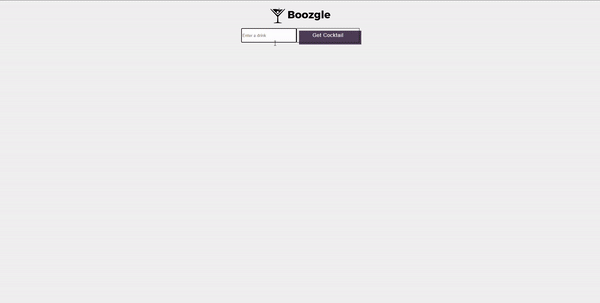

## Boozgle: <a href="https://boozgle.netlify.app" target="_blank">Check it out here</a>

### Find the next cocktail to try with your favorite alcoholic ingredient

## Tech Used: 

My learning was focused on understanding how to use APIs to obtain the information I wanted to display to the user. 

## Optimizations

To improve this project, I would like to maybe try adding the drinks in a carousel. Additionally, I would like for drinks to be suggested based on not only alcoholic drinks but also other ingredients such as Curaçao.

## Lessons Learned:

I learned about how to fetch data from an API and pick and choose what I needed to display on the front-end of my website. Additionally, I explored the use of animation properties in css to add some more interactivity to the page (i.e. button)

## More Projects

<table bordercolor="#66b2b2">
  
  <tr>
    <td width="33.3%"  style="align:center;" valign="top">
<a target="_blank" href="https://github.com/christurc29/Recipe-Generator">Recipe Generator</a>
         
      
    </td>
    <td width="33.3%" valign="top">
<a target="_blank" href="https://github.com/CharlesCreativeContent/matching-card-game"> Portfolio</a>
       
        
    </td>
    <td width="33.3%" valign="top">
<a target="_blank" href="https://interi-design.netlify.app/">Interi Agency</a>
         
        
    </td>
  </tr>
</table>
